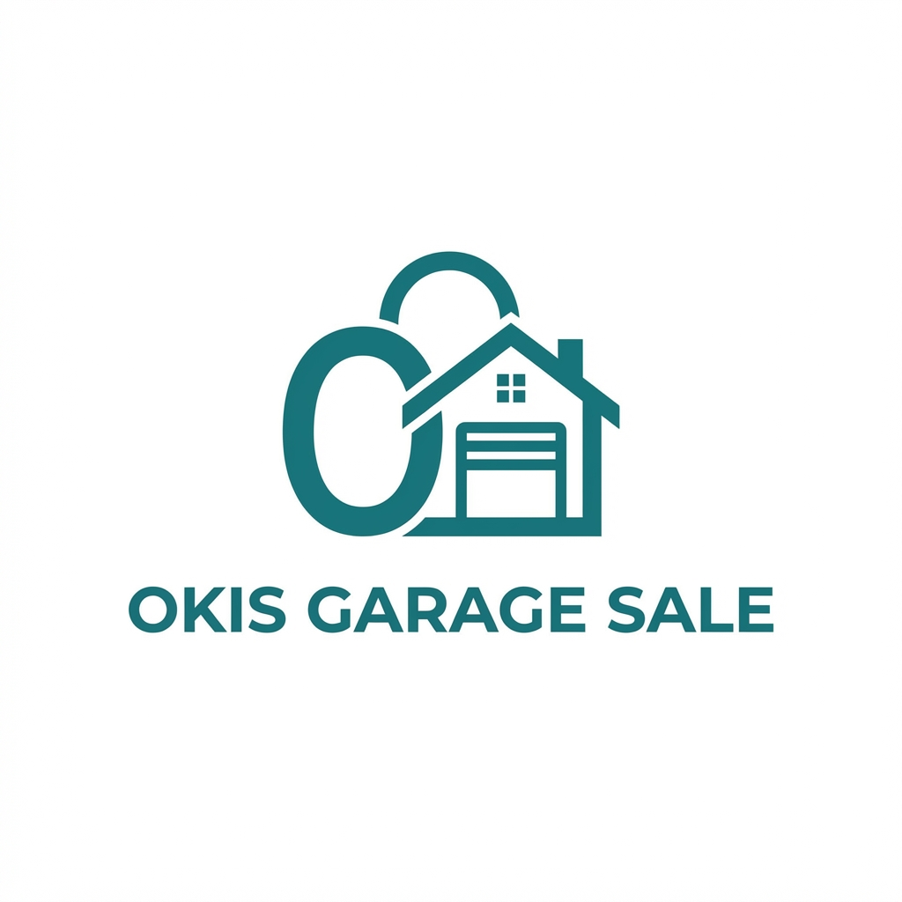

<p align="center">
  
</p>

<h1 align="center">🏪 Okis Garage Sale</h1>

<p align="center">
  <strong>Marketplace Barang Bekas Terpercaya di Indonesia</strong>
</p>

<p align="center">
  <em>Temukan treasure tersembunyi, jual barang preloved-mu dengan mudah!</em>
</p>

<p align="center">
  <a href="https://github.com/asyaperdana/marketplace-prototype/actions">
    
  </a>
  <a href="https://github.com/asyaperdana/marketplace-prototype/blob/main/LICENSE">
    
  </a>
  
  
</p>

<p align="center">
  <a href="#-features">Features</a> •
  <a href="#-tech-stack">Tech Stack</a> •
  <a href="#-getting-started">Getting Started</a> •
  <a href="#-roadmap">Roadmap</a> •
  <a href="#-contributing">Contributing</a>
</p>

---

## 🌟 Overview

**Okis Garage Sale** adalah platform marketplace yang mempertemukan penjual dan pembeli barang bekas (preloved) di Indonesia. Dengan fokus pada kepercayaan dan kemudahan transaksi, kami bertujuan untuk memberikan pengalaman jual-beli barang secondhand yang aman dan menyenangkan.

### 💡 Why Okis Garage Sale?

- 🛡️ **Terpercaya** - Sistem verifikasi penjual dan review yang transparan
- 💰 **Hemat** - Temukan barang berkualitas dengan harga terjangkau
- 🌍 **Eco-Friendly** - Dukung sustainable living dengan reuse & recycle
- 🚀 **Mudah** - Interface yang simpel dan user-friendly

---

## ✨ Features

### ✅ Current Features (MVP)

- [x] 🎨 Modern landing page dengan glassmorphism design
- [x] 📱 Responsive design (mobile-first approach)
- [x] 🧭 Navigation bar dengan scroll effects
- [x] 📊 Stats section dengan animated counters
- [x] 💎 Value propositions showcase
- [x] 📦 Categories section
- [x] 🌟 Featured products display
- [x] 💬 Testimonials carousel
- [x] ❓ FAQ section
- [x] 📧 Newsletter subscription form
- [x] 📱 Mobile bottom navigation
- [x] 🔒 Trust & security badges

### 🔜 Planned Features

- [ ] 🔐 User authentication (Login/Register)
- [ ] 👤 User profile & dashboard
- [ ] 📝 Product listing creation
- [ ] 🔍 Advanced search & filter
- [ ] 💬 In-app chat messaging
- [ ] 💳 Payment integration
- [ ] 📍 Location-based search
- [ ] ⭐ Rating & review system
- [ ] 🔔 Push notifications
- [ ] 📦 Order tracking

---

## 🛠️ Tech Stack

<p align="center">
  
  
  
  
</p>

| Category | Technology |
|----------|------------|
| **Framework** | [SvelteKit](https://kit.svelte.dev/) v2.50+ |
| **Language** | [TypeScript](https://www.typescriptlang.org/) v5.9+ |
| **Styling** | [TailwindCSS](https://tailwindcss.com/) v4.1+ |
| **Build Tool** | [Vite](https://vitejs.dev/) v7.3+ |
| **Deployment** | GitHub Pages / Vercel |

---

## 🚀 Getting Started

### Prerequisites

Pastikan kamu sudah menginstall:

- [Node.js](https://nodejs.org/) v18 atau lebih baru
- [npm](https://www.npmjs.com/) v9+ atau [pnpm](https://pnpm.io/)

### Installation

```bash
# Clone repository
git clone https://github.com/asyaperdana/marketplace-prototype.git

# Masuk ke direktori project
cd marketplace-prototype

# Install dependencies
npm install

# Jalankan development server
npm run dev
```

### Available Scripts

| Command | Description |
|---------|-------------|
| `npm run dev` | Start development server di `localhost:5173` |
| `npm run build` | Build untuk production |
| `npm run preview` | Preview production build |
| `npm run check` | Run TypeScript & Svelte checks |

---

## 📁 Project Structure

```
marketplace-prototype/
├── 📂 src/
│   ├── 📂 lib/
│   │   ├── 📂 assets/          # Static assets (images, icons)
│   │   ├── 📂 components/      # Svelte components
│   │   │   ├── Categories.svelte
│   │   │   ├── FAQ.svelte
│   │   │   ├── FeaturedProducts.svelte
│   │   │   ├── Footer.svelte
│   │   │   ├── Hero.svelte
│   │   │   ├── HowItWorks.svelte
│   │   │   ├── MobileBottomNav.svelte
│   │   │   ├── Navbar.svelte
│   │   │   ├── Newsletter.svelte
│   │   │   ├── Stats.svelte
│   │   │   ├── Testimonials.svelte
│   │   │   ├── TrustSecurity.svelte
│   │   │   └── ValueProps.svelte
│   │   └── index.ts
│   ├── 📂 routes/
│   │   ├── +layout.svelte      # Root layout
│   │   └── +page.svelte        # Homepage
│   ├── app.css                 # Global styles
│   ├── app.d.ts                # TypeScript declarations
│   └── app.html                # HTML template
├── 📂 static/                  # Public static files
├── svelte.config.js            # SvelteKit configuration
├── tailwind.config.js          # Tailwind configuration
├── tsconfig.json               # TypeScript configuration
├── vite.config.ts              # Vite configuration
└── package.json
```

---

## 🗺️ Roadmap

### Phase 1: Foundation (Current) 🏗️
**Q1 2026**
- [x] Landing page MVP
- [x] Responsive design implementation
- [x] Component library setup
- [ ] GitHub Pages deployment

### Phase 2: Core Features 🔨
**Q2 2026**
- [ ] User authentication system
- [ ] Product listing CRUD
- [ ] Search & filter functionality
- [ ] Database integration (Supabase/PocketBase)

### Phase 3: Marketplace Features 🛒
**Q3 2026**
- [ ] In-app messaging
- [ ] Payment gateway integration
- [ ] Order management
- [ ] Rating & review system

### Phase 4: Scale & Optimize 📈
**Q4 2026**
- [ ] Performance optimization
- [ ] SEO improvements
- [ ] Mobile app (PWA)
- [ ] Analytics dashboard

---

## 🤝 Contributing

Kami sangat menghargai kontribusi dari community! 

Silakan baca [**CONTRIBUTING.md**](CONTRIBUTING.md) untuk panduan lengkap tentang:
- Code of conduct
- Development workflow
- Pull request process
- Coding standards

### Quick Start untuk Contributors

```bash
# Fork repository ini
# Clone fork kamu
git clone https://github.com/YOUR_USERNAME/marketplace-prototype.git

# Buat branch baru
git checkout -b feature/amazing-feature

# Commit changes
git commit -m 'Add some amazing feature'

# Push ke branch
git push origin feature/amazing-feature

# Buka Pull Request
```

---

## 📄 License

Distributed under the **MIT License**. See [LICENSE](LICENSE) for more information.

```
MIT License

Copyright (c) 2026 Okis Garage Sale

Permission is hereby granted, free of charge, to any person obtaining a copy
of this software and associated documentation files...
```

---

## 📬 Contact & Connect

<p align="center">
  <a href="https://github.com/asyaperdana">
    
  </a>
  <a href="https://twitter.com/okisgaragesale">
    
  </a>
  <a href="https://instagram.com/okisgaragesale">
    
  </a>
  <a href="mailto:hello@okisgaragesale.id">
    
  </a>
</p>

<p align="center">
  <strong>👨‍💻 Maintainer:</strong> <a href="https://github.com/asyaperdana">@asyaperdana</a>
</p>

---

<p align="center">
  
</p>

<p align="center">
  <strong>⭐ Star this repo jika project ini membantu kamu!</strong>
</p>

<p align="center">
  <sub>Built with ❤️ by the Okis Garage Sale Team</sub>
</p>
